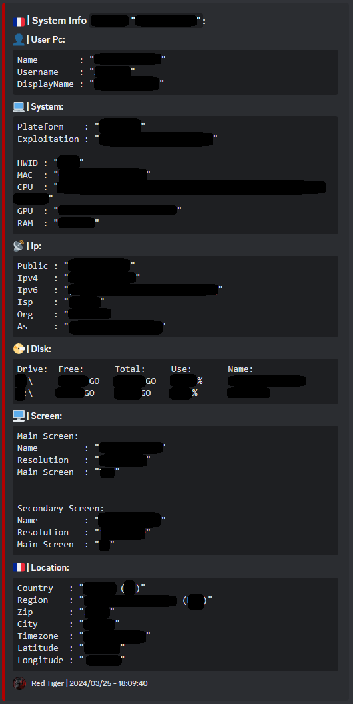
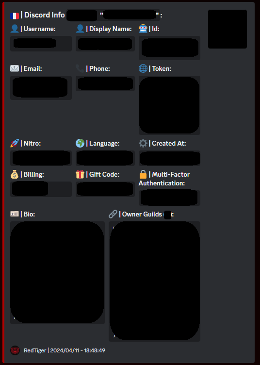
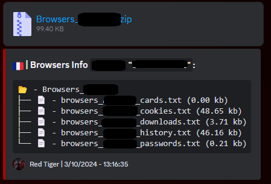
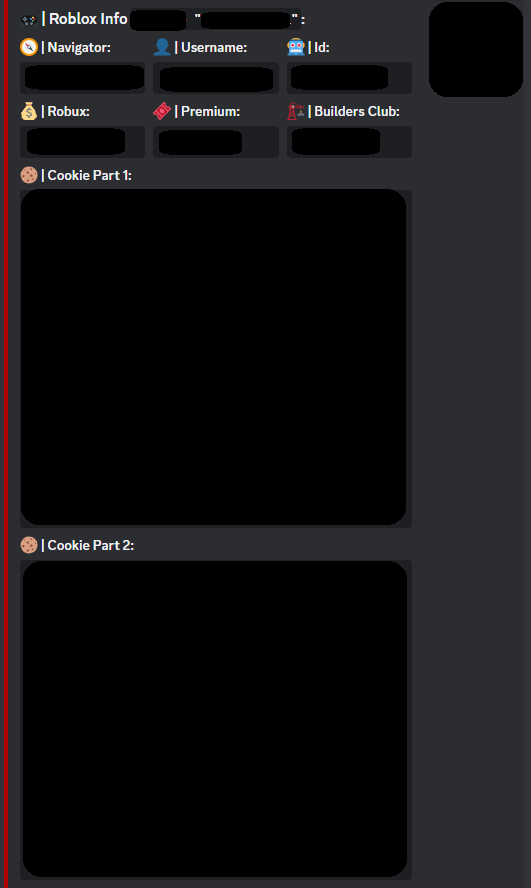

<h1 align="center">RedTiger Multi-Tool 🐯</h1> 
<p align="center">
  
  
  
  

</p>


<h2>📜・Description:</h2>
<p>
👨‍💻 -> Developed in <strong>Python</strong>.<br>
🌍 -> Tool in <strong>English</strong>.<br>
🔎 -> <strong>No viruses</strong> or <strong>token grabbers</strong>.<br>
📂 -> <strong>Open Source</strong> only for verification, ensuring no viruses or malicious programs.<br>
🔄 -> <strong>Frequently updated</strong>.<br>
💰 -> <strong>Free</strong> for everyone.<br>
</p>

<h2>⚙️・Functions:</h2>
<p align="center">
  
```
   [Page n°1]
   [01] -> Tool Info                      [11] -> Discord Webhook Generator      [21] -> Discord Token Generator
   [02] -> Web Site                       [12] -> Discord Webhook Info           [22] -> Discord Token Spammer
   [03] -> Ip Info                        [13] -> Discord Webhook Delete         [23] -> Discord Token Mass Dm
   [04] -> Ip Pinger                      [14] -> Discord Webhook Spammer        [24] -> Discord Token Status Changer
   [05] -> Ip Generator                   [15] -> Discord Token Info             [25] -> Discord Token Language Changer
   [06] -> Dox Tracker                    [16] -> Discord Token Nuker            [26] -> Discord Token Theme Changer
   [07] -> Dox Create                     [17] -> Discord Token Joiner           [27] -> Discord Token House Changer
   [08] -> Number Info                    [18] -> Discord Token Leaver (soon)    [28] -> Discord Bot Invite To Id
   [09] -> Builder Stealer                [19] -> Discord Token Login            [29] -> Discord Bot Server Nuker
   [10] -> Illegal Website                [20] -> Discord Token To Id            [30] -> Next Page ▶

   [Page n°2]
   [31] -> ◀ Previous Page              
   [32] -> Discord Server Info        
   [33] -> Discord Nitro Generator    
   [34] -> Roblox Cookie Login          
   [35] -> Roblox Cookie Info           
   [36] -> Roblox User Info             
   [37] -> Roblox Id Info             
   [38] -> Youtube Downloader
   [39] -> Browser Private

┌───(username@redtiger)─[~]
└──$
```
</p>

<h2>🔒・Requirements:</h2>
<p>
- You need to <a href="https://www.python.org/downloads/">install Python</a> with the <strong>PATH</strong> option. <a href="https://www.python.org/downloads/">Download Here</a><br>
- You need to <a href="https://git-scm.com/download/win">install GIT</a> with the <strong>PATH</strong> option. <a href="https://git-scm.com/download/win">Download Here</a><br>
- Windows 10/11
</p>
<h2>⏳・Installation:</h2>
<p>

```
Install with Git:
  1) Press sumiltamemen on "windows + r" and open "cmd",
  2) Write in cmd "git clone https://github.com/fluzyteck/RedTiger",
  3) Write in cmd "cd RedTiger",
  4) Write in cmd "code .",
  5) Launch "Setup.bat".

Install with GitHub:
  1) Press the green “<> Code” button,
  2) Press "Download ZIP" button,
  3) Extract the file "RedTiger-main.zip" to your desktop,
  4) Launch "Setup.bat".
```
Or install the Red Tiger tool <a href="https://github.com/fluzyteck/RedTiger/archive/main.zip
">Here</a> and launch "Setup.bat".
</p>

<h2>💀・Stealer/Grabber:</h2>
<div align="center">
   
   
   
   
   
</div>

<h3>🔗・Credits:</h3>
<p>
- <a href="https://discord.gg/XUs2f9jz8j">Discord Server</a><br>
- <a href="https://red-tiger.000webhostapp.com/accueil.html">Site Web</a><br>
- <a href="https://www.tiktok.com/@fluzyteck">Tiktok</a><br>
- <a href="https://www.youtube.com/channel/UCB3ABdJP25ULxbydw4ldHjw">Youtube</a><br>
- Creator: FluzyTeck<br>
- Version: 3.4
</p>
