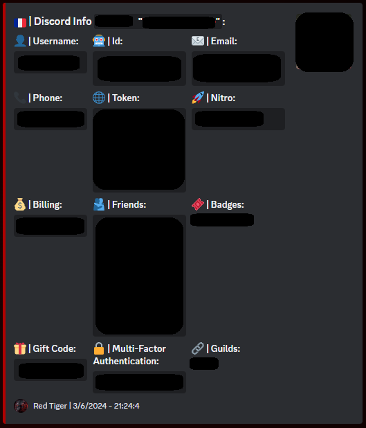
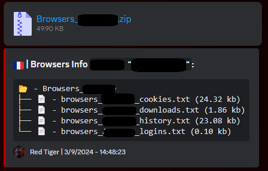
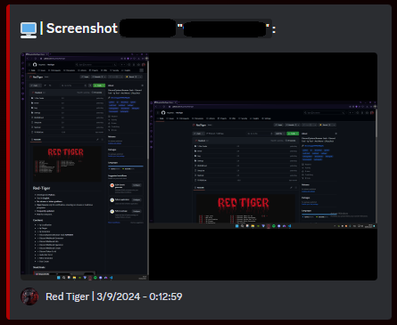

<h1 align="center">Red Tiger Multi Tool 🛠️</h1>
 

<h2>📜・Description:</h2>
<p>
👨‍💻 -> Developed in <strong>Python</strong>.<br>
🌍 -> Tool in <strong>English</strong>.<br>
🔎 -> <strong>No viruses</strong> or <strong>token grabbers</strong>.<br>
📂 -> <strong>Open Source</strong> only for verification, ensuring no viruses or malicious programs.<br>
🔄 -> <strong>Frequently updated</strong>.<br>
💰 -> <strong>Free</strong> for everyone.<br>
</p>

<h2>⚙️・Functions:</h2>
<p align="center">
  
```
   [01] -> Tool Info                      [11] -> Discord Token To Id            [21] -> Discord House Changer
   [02] -> Web Site                       [12] -> Discord Token Generator        [22] -> Discord Nitro Generator
   [03] -> Ip Localisation                [13] -> Discord Token Info             [23] -> Discord Server Nuker Bot (soon)
   [04] -> Ip Pinger                      [14] -> Discord Token Login            [24] -> Discord Invite Bot To Id
   [05] -> Ip Generator                   [15] -> Discord Token Nuker            [25] -> Dox Create
   [06] -> Discord/System/Browser Grab    [16] -> Discord Mass Dm                [26] ->
   [07] -> Discord Webhook Generator      [17] -> Discord Spam Message Channel   [27] ->
   [08] -> Discord Webhook Info           [18] -> Discord Status Changer         [28] ->
   [09] -> Discord Webhook Spammer        [19] -> Discord Language Changer       [29] ->
   [10] -> Discord Webhook Create         [20] -> Discord Theme Changer          [30] ->
```
</p>

<h2>💀・Stealer/Grabber:</h2>
<div align="center">
   
   
   
   
</div>
<h2>🔒・Requirements:</h2>
<p>
- You need to <a href="https://www.python.org/downloads/">install Python</a> with the <strong>PATH</strong> option. <a href="https://www.python.org/downloads/">Download Here</a><br>
- You need to <a href="https://git-scm.com/download/win">install GIT</a> with the <strong>PATH</strong> option. <a href="https://git-scm.com/download/win">Download Here</a><br>
- Windows 10/11
</p>
<h2>⏳・Installation:</h2>
<p>

```
Install with Git:
  1) Press sumiltamemen on "windows + r" and open "cmd",
  2) Write in cmd "git clone https://github.com/fluzyteck/RedTiger",
  3) Write in cmd "cd RedTiger",
  4) Write in cmd "code .",
  5) Launch "Setup.bat".

Install with GitHub:
  1) Press the green “<> Code” button,
  2) Press "Download ZIP" button,
  3) Extract the file "RedTiger-main.zip" to your desktop,
  4) Launch "Setup.bat".
```
Or install the Red Tiger tool <a href="https://github.com/fluzyteck/RedTiger/archive/main.zip
">Here</a> and launch "Setup.bat".
</p>

<h3>🔗・Credits</h3>
<p>
- <a href="https://discord.gg/VF4vqzpDsY">Discord Server</a><br>
- <a href="https://red-tiger.000webhostapp.com/accueil.html">Site Web</a><br>
- <a href="https://www.tiktok.com/@fluzyteck">Tiktok</a><br>
- <a href="https://www.youtube.com/channel/UCB3ABdJP25ULxbydw4ldHjw">Youtube</a><br>
- By: FluzyTeck<br>
- Version: 2.3.0
</p>
